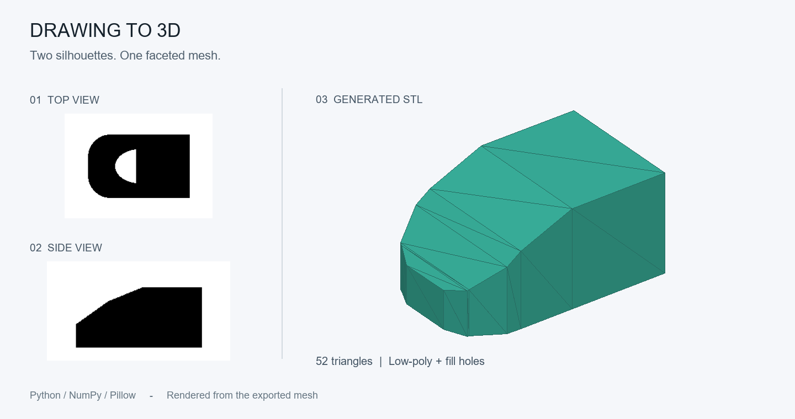
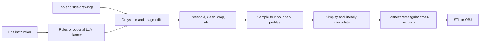

# Drawing to 3D Agent

Turn a top-view drawing and a side-view drawing into a faceted STL mesh using
Python. Simplify pixel-step outlines into straight segments, align the two views,
and connect their profiles into a 3D model.

Built for experimenting with drawing-based modeling and 3D-printable concept
shapes. Runs locally with NumPy and Pillow; no API key is required by default.



[Download the example STL](docs/demo.stl) | [Architecture](docs/ARCHITECTURE.md)

## Features

- **Two-view reconstruction:** combine top and side silhouettes along a shared axis.
- **Low-poly outlines:** simplify small turns and interpolate straight segments to
  reduce pixel-step ridges.
- **View alignment:** independently mirror or flip either input.
- **Prompt-guided edits:** thicken lines, fill holes, remove specks, or add a base.
- **STL and OBJ export:** use a slicer or mesh editor to inspect the output.
- **Python API and CLI:** save mask previews and get generation statistics as JSON.
- **Alternative modes:** single-image extrusion and a voxel-based two-view hull.

## Quick Start

Requires Python 3.10 or newer. Download or clone this repository, open its folder,
and install the package in a virtual environment:

```sh
python -m venv .venv
```

Activate it with `.venv\Scripts\Activate.ps1` in PowerShell or
`source .venv/bin/activate` on macOS/Linux, then:

```sh
python -m pip install -e .
python -m drawing_to_3d_agent examples/sample_top_view.png outputs/model.stl --side-image examples/sample_side_view.png --low-poly --fill-holes --max-size 160 --preview outputs/top.png --side-preview outputs/side.png --json
```

Open `outputs/model.stl` in your slicer or mesh editor. The sample input images are
included; regenerate them with `python examples/make_two_view_sample.py`.
The installed `draw3d-agent` command also invokes the CLI.

## Use Your Own Drawings

Use high-contrast, filled silhouettes on a plain background. An enclosed outline
can be filled with `--fill-holes`. These should be orthographic drawings of the
same object, with matching endpoints and proportions along the shared axis.

```sh
draw3d-agent top.png outputs/custom.stl --side-image side.png --low-poly --low-poly-angle 10 --low-poly-tolerance 3 --fill-holes
```

The first image is always the top view. The side image's horizontal axis aligns
with the top image's horizontal axis by default. Use `--side-axis y` when the
object's length runs vertically in the top image. For that setting, the top of
the top-view image aligns with the left of the side-view image. If they are
reversed, add `--top-flip-vertical` or `--side-mirror`.

| Option | Effect |
| --- | --- |
| `--low-poly-angle 10` | Remove turns smaller than this angle after outline simplification. |
| `--low-poly-tolerance 3` | Initial simplification tolerance in processed pixels. Higher values remove more detail. |
| `--max-size 160` | Limit the processed image resolution. Changing this also changes model size at a fixed pixel size. |
| `--pixel-size 0.4` | Model units per processed pixel; interpret as mm in a slicer. |
| `--top-mirror`, `--top-flip-vertical` | Correct top-view orientation. |
| `--side-mirror`, `--side-flip-vertical` | Correct side-view orientation. |
| `--threshold 180`, `--ink dark` | Control which image pixels count as the silhouette. |
| `--preview top.png`, `--side-preview side.png` | Save processed raster masks for inspection. |

Keep `--smooth-iterations` at its default of zero for straight low-poly edges.
The preview PNGs show raster masks, not the simplified mesh outline. The mesh can
therefore have straight edges even when the preview shows pixel steps.

STL does not store units. Check the exported dimensions before printing and scale
in your slicer if necessary. Infill and supports are configured in the slicer.

## Python API

```python
from drawing_to_3d_agent import AgentConfig, DrawingTo3DAgent

agent = DrawingTo3DAgent(AgentConfig(
    low_poly=True,
    low_poly_angle=10,
    low_poly_tolerance=3,
    max_size=160,
    fill_holes=True,
))
result = agent.generate(
    "top.png",
    "outputs/model.stl",
    side_image="side.png",
    prompt="clean specks",
)
print(result.generation_mode, result.triangle_count, result.output_path)
```

For a single-image extrusion, omit `side_image` and set `height` in `AgentConfig`.
For an OBJ mesh, use an output filename ending in `.obj`.

## Does It Use GPT?

The default `rules` planner maps supported phrases to local image operations.
It is deterministic and does not call GPT, train a model, or upload images.
Examples include `make it thicker`, `fill holes`, `mirror it`, `rotate 90 degrees`,
`clean specks`, and `add a base`. It matches keywords rather than understanding
arbitrary language, so negation and complex instructions can be misinterpreted.

An optional `openai` planner sends the edit instruction text to the OpenAI API and
converts the response into image operations. Image processing and mesh generation
still happen locally. Install the optional dependency with
`python -m pip install -e ".[openai]"`, set `OPENAI_API_KEY` in your environment,
and select `--planner openai --openai-model YOUR_MODEL_ID`. This mode needs your
own API access and may incur API charges. Never commit an API key.

## How It Works



See [the architecture notes](docs/ARCHITECTURE.md) for the reasoning behind the
straight-edge interpolation and the tradeoffs of using only two views.

## Tests

```sh
python -m unittest discover -s tests -v
```

The suite checks watertight sample geometry, outward face orientation, preservation
of straight ramps when the other view has extra corners, view flipping, export
formats, and CLI behavior. GitHub Actions runs it on Windows and Linux with
Python 3.10 and 3.12. Tests use the local planner and need no credentials.

Rebuild the README illustration and sample STL:

```sh
python -m examples.make_demo
```

## Limitations

- Two silhouettes do not determine a unique 3D object. Perspective photos,
  hidden surfaces, material appearance, and fine surface detail are not recovered.
- Low-poly mode uses one rectangular cross-section at each sampled position.
  It fills internal gaps and can bridge disconnected sections. Use voxel mode
  without `--low-poly` when silhouette cutouts matter, accepting stepped edges.
- Tolerance is applied before angle pruning; it is not a strict final error bound.
  Strong simplification can lose shape details or create invalid local geometry.
- The optional base is a separate touching shell, not a Boolean union. Complex
  inputs and bases need inspection or repair in a mesh tool before printing.
- This is a concept-mesh generator, not parametric CAD or a footwear fit system.
  It does not produce a hollow shoe upper or separate sole.

Possible future work includes dimension calibration, contour editing, and
additional views or cross-section controls. These are not currently implemented.
